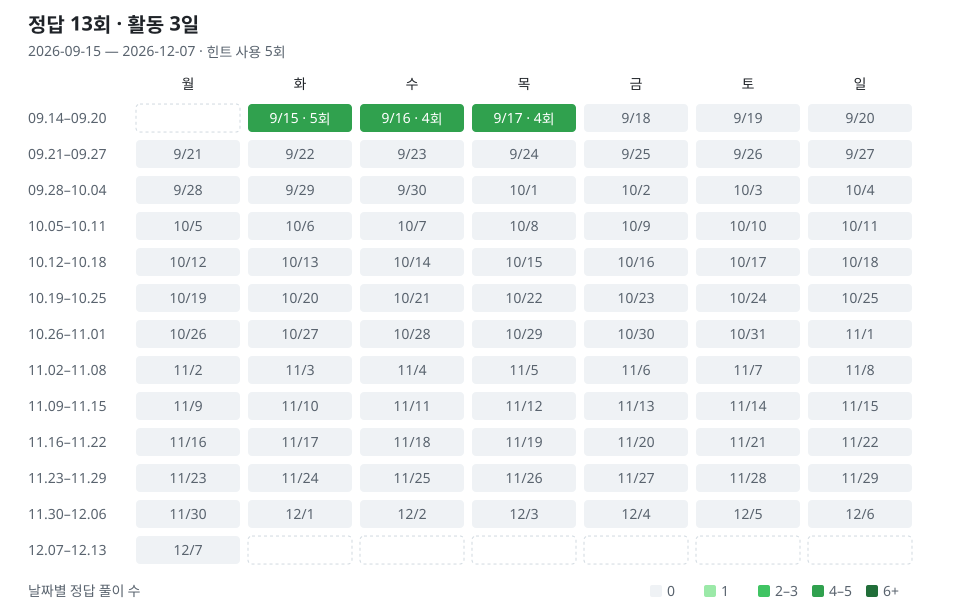

# Problem-Solving-Factory

C++ 코딩테스트 · 12주 / 84일 · 신규 208문제 + 재풀이 75회

[진도표](https://github.com/Nu-LungJi/Problem-Solving-Factory/tree/progress) · [커리큘럼](curriculum/plan.md) · [추가 문제 후보](curriculum/pools.md)

[사용법](curriculum/windows-workflow.md) · [기록 방법](curriculum/README.md) · [풀이 기록](curriculum/records.json)
